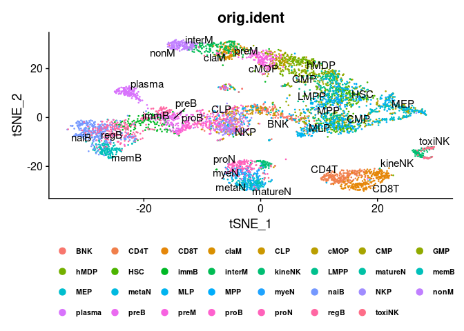

scRNA\_workflow
================
Enrique de la Rosa Morón
20/10/2023
**This script is also part of my Shiny-app which currently is private due to confidential issues.** 

# Abstract

In this script we will show how to perform a general **Single-cell
RNA-seq** data analysis.

Specifically, we are going to analyze **7643** cells from **healthy
human bone marrow** and **peripheral blood** samples.

To know how to filter and doing subsetting, we are going to work with
**CDs markers genes** and we will **delete erythrocytes** from our list.

# Data uploading, exploring and subsetting

Uploading needed packages

``` r
library(Seurat)
library(RColorBrewer)
library(dplyr)
library(ggplot2)
library(scater)
library(TSCAN)
library(scran)
library(igraph)
col <- RColorBrewer::brewer.pal(20, "Set3")
```

The given raw matrix have already been filetered and it has the
following structure: **genes in columns** and **cells in rows**.

``` r
setwd("/home/enrique/CDs_project/dataset_1/")
matrix_single_cell <- read.csv("GSE149938_umi_matrix.csv.gz")
matrix_single_cell[c(2,500,650,790,1050,2000,3400,3600,4000,5000), c(2:15)]
```

    ##                      FO538757.3 FO538757.2 OR4F29 OR4F16 SAMD11 NOC2L KLHL17
    ## BNK_spBM1_L1_bar26            0          0      0      0      0     0      0
    ## CD8T_tBM_L1_bar15             0          0      0      0      0     0      0
    ## CD8T_tPB_L5_bar68             0          0      0      0      0     0      0
    ## claM_moBM2_L11_bar56          0          0      0      0      0     0      0
    ## CLP_nkBM2_L4_bar22            0          0      0      0      0     0      0
    ## ery_eBM3_L8_bar57             0          0      0      0      0     0      0
    ## GMP_spBM3_L5_bar90            0          0      0      0      0     4      0
    ## hMDP_moBM1_L8_bar41           0          0      0      0      0     0      0
    ## immB_bBM1_L14_bar37           0          0      0      0      0     0      0
    ## MEP_spBM2_L5_bar76            0          0      0      0      0     0      0
    ##                      PLEKHN1 PERM1 HES4 ISG15 AGRN RNF223 C1orf159
    ## BNK_spBM1_L1_bar26         0     0    0     0    0      0        0
    ## CD8T_tBM_L1_bar15          0     0    0     0    0      0        0
    ## CD8T_tPB_L5_bar68          0     0    0     0    0      0        0
    ## claM_moBM2_L11_bar56       0     0    0     0    0      0        0
    ## CLP_nkBM2_L4_bar22         0     0    0     0    0      0        0
    ## ery_eBM3_L8_bar57          0     0    0     0    0      0        0
    ## GMP_spBM3_L5_bar90         0     0    0     0    0      0        0
    ## hMDP_moBM1_L8_bar41        0     0    0     1    0      0        1
    ## immB_bBM1_L14_bar37        0     0    0     0    0      0        0
    ## MEP_spBM2_L5_bar76         0     0    0     1    0      0        0

As we work with ***Seurat*** package, we have to reorder cells in
columns and genes in rows, meaning that we have to work with the
transpose of our matrix.

``` r
matrix_single_cell <- t(matrix_single_cell)
matrix_single_cell[c(2,500,650,790,1050,2000,3400,3600,4000,5000), c(2:13)]
```

    ##            BNK_spBM1_L1_bar26 BNK_spBM1_L1_bar27 BNK_spBM1_L1_bar28
    ## FO538757.3                  0                  0                  0
    ## THRAP3                      0                 31                  2
    ## KNCN                        0                  0                  0
    ## SRSF11                      3                 16                  0
    ## PTGFRN                      0                  0                  0
    ## GCSAML                      0                  0                  0
    ## SGOL1                       0                  4                  0
    ## CCDC71                      0                  0                  0
    ## H1FX                        0                 36                  5
    ## MAP9                        0                  0                  0
    ##            BNK_spBM1_L1_bar29 BNK_spBM1_L1_bar30 BNK_spBM1_L1_bar31
    ## FO538757.3                  0                  0                  0
    ## THRAP3                      5                  0                  9
    ## KNCN                        0                  0                  0
    ## SRSF11                     44                  1                  0
    ## PTGFRN                      0                  0                  0
    ## GCSAML                      0                  0                  0
    ## SGOL1                       0                  0                  0
    ## CCDC71                      0                  0                  0
    ## H1FX                        1                  1                  0
    ## MAP9                        0                  0                  0
    ##            BNK_spBM1_L1_bar32 BNK_spBM1_L1_bar33 BNK_spBM1_L1_bar35
    ## FO538757.3                  0                  0                  0
    ## THRAP3                     36                 38                 28
    ## KNCN                        0                  0                  0
    ## SRSF11                     12                 18                 15
    ## PTGFRN                      0                  0                  0
    ## GCSAML                      0                  0                  0
    ## SGOL1                       3                 10                  5
    ## CCDC71                      0                  0                  0
    ## H1FX                        0                  0                  0
    ## MAP9                        0                  0                  0
    ##            BNK_spBM1_L1_bar36 BNK_spBM1_L1_bar37 BNK_spBM1_L1_bar38
    ## FO538757.3                  0                  0                  0
    ## THRAP3                     20                 73                 68
    ## KNCN                        0                  0                  0
    ## SRSF11                      7                 30                 63
    ## PTGFRN                      0                  0                  0
    ## GCSAML                      0                  0                  0
    ## SGOL1                       0                 42                  8
    ## CCDC71                      0                  0                  0
    ## H1FX                        1                  5                  0
    ## MAP9                        0                  0                 18

## Exploring data matrix distribution

As usually happens in Single-cell data, we could see **lots of 0s** in
our matrix

``` r
boxplot(matrix_single_cell[,1:20], main= "Data disribution boxplot", 
        names = c("BNK_1", "BNK_2", "BNK_3", "BNK_4", "BNK_5", "BNK_6", "BNK_7", 
                  "BNK_8", "BNK_9", "BNK_10", "BNK_11", "BNK_12", "BNK_13", 
                  "BNK_14", "BNK_15", "BNK_16", "BNK_17", "BNK_18", "BNK_19", 
                  "BNK_20"), las=2, col = col, outline= T)
```

<!-- -->

## Subset with CDs genes markers and deleting erythocytes

First, we have to upload the list with the currently known CDs, with
**gene nomenclature name** and **CDs nomenclature** one.

``` r
CD_gene_names <- read.delim2("/home/enrique/CD_gene_names.txt", header = F, 
                             col.names = "CD_gene_names")
CD_gene_names <- CD_gene_names$CD_gene_names
CD_gene_names[1:30]
```

    ##  [1] "CD1A"   "CD1B"   "CD1C"   "CD1D"   "CD1E"   "CD2"    "CD3D"   "CD3E"  
    ##  [9] "CD3G"   "CD4"    "CD5"    "CD6"    "CD7"    "CD8A"   "CD8B"   "CD9"   
    ## [17] "MME"    "ITGAL"  "ITGAM"  "ITGAX"  "ITGAD"  "ANPEP"  "CD14"   "FCGR3A"
    ## [25] "FCGR3B" "ITGB2"  "CD19"   "MS4A1"  "CR2"    "CD22"

``` r
CD_identifiers <- read.delim2("/home/enrique/CD_identifiers.txt", header = F, 
                              col.names = "CD_identifiers")
CD_identifiers <- CD_identifiers$CD_identifiers
CD_identifiers[1:30]
```

    ##  [1] "CD1a"  "CD1b"  "CD1c"  "CD1d"  "CD1e"  "CD2"   "CD3d"  "CD3e"  "CD3g" 
    ## [10] "CD4"   "CD5"   "CD6"   "CD7"   "CD8a"  "CD8b"  "CD9"   "CD10"  "CD11a"
    ## [19] "CD11b" "CD11c" "CD11d" "CD13"  "CD14"  "CD16a" "CD16b" "CD18"  "CD19" 
    ## [28] "CD20"  "CD21"  "CD22"

Now, we will do the subset, building a matrix with our 369 CDs genes and
specifically with **CDs nomenclature**.

``` r
matrix_single_cell <- matrix_single_cell[CD_gene_names,]
matrix_single_cell_2 <- matrix_single_cell[match(CD_gene_names, 
                                                 rownames(matrix_single_cell)),]
dim(matrix_single_cell_2)
```

    ## [1]  369 7643

``` r
table(rownames(matrix_single_cell_2) %in% CD_gene_names)
```

    ## 
    ## TRUE 
    ##  369

``` r
matrix_single_cell_3 <- cbind(rownames(matrix_single_cell_2), CD_identifiers, 
                              matrix_single_cell_2)
rownames(matrix_single_cell_3) <- as.character(matrix_single_cell_3[,2])
rownames(matrix_single_cell_3)
```

    ##   [1] "CD1a"    "CD1b"    "CD1c"    "CD1d"    "CD1e"    "CD2"     "CD3d"   
    ##   [8] "CD3e"    "CD3g"    "CD4"     "CD5"     "CD6"     "CD7"     "CD8a"   
    ##  [15] "CD8b"    "CD9"     "CD10"    "CD11a"   "CD11b"   "CD11c"   "CD11d"  
    ##  [22] "CD13"    "CD14"    "CD16a"   "CD16b"   "CD18"    "CD19"    "CD20"   
    ##  [29] "CD21"    "CD22"    "CD23"    "CD25"    "CD26"    "CD27"    "CD28"   
    ##  [36] "CD29"    "CD30"    "CD32a"   "CD32b"   "CD33"    "CD34"    "CD35"   
    ##  [43] "CD36"    "CD37"    "CD38"    "CD39"    "CD40"    "CD41"    "CD42a"  
    ##  [50] "CD42b"   "CD42c"   "CD42d"   "CD43"    "CD44"    "CD46"    "CD47"   
    ##  [57] "CD48"    "CD49a"   "CD49b"   "CD49c"   "CD49d"   "CD49e"   "CD49f"  
    ##  [64] "CD50"    "CD51"    "CD52"    "CD53"    "CD54"    "CD55"    "CD56"   
    ##  [71] "CD58"    "CD59"    "CD61"    "CD62"    "CD62e"   "CD62l"   "CD63"   
    ##  [78] "CD64"    "CD66a"   "CD66b"   "CD66c"   "CD66d"   "CD66e"   "CD66f"  
    ##  [85] "CD68"    "CD69"    "CD70"    "CD71"    "CD72"    "CD73"    "CD74"   
    ##  [92] "CD79a"   "CD79b"   "CD80"    "CD81"    "CD82"    "CD83"    "CD84"   
    ##  [99] "CD85a"   "CD85c"   "CD85d"   "CD85f"   "CD85g"   "CD85h"   "CD85i"  
    ## [106] "CD85k"   "CD86"    "CD87"    "CD88"    "CD89"    "CD90"    "CD91"   
    ## [113] "CD92"    "CD93"    "CD94"    "CD95"    "CD96"    "CD97"    "CD98"   
    ## [120] "CD99"    "CD100"   "CD101"   "CD102"   "CD103"   "CD104"   "CD105"  
    ## [127] "CD106"   "CD107a"  "CD107b"  "CD108"   "CD109"   "CD110"   "CD114"  
    ## [134] "CD115"   "CD116"   "CD117"   "CD118"   "CD119"   "CD120a"  "CD120b" 
    ## [141] "CD121a"  "CD121b"  "CD122"   "CD123"   "CD124"   "CD125"   "CD126"  
    ## [148] "CD127"   "CD129"   "CD130"   "CD131"   "CD132"   "CD133"   "CD134"  
    ## [155] "CD135"   "CD136"   "CD137"   "CD138a"  "CD138b"  "CD140a"  "CD140b" 
    ## [162] "CD141"   "CD142"   "CD143"   "CD144"   "CD146"   "CD147"   "CD148"  
    ## [169] "CD150"   "CD151"   "CD152"   "CD153"   "CD154"   "CD155"   "CD156a" 
    ## [176] "CD156b"  "CD156c"  "CD157"   "CD158a"  "CD158b2" "CD158d"  "CD158e" 
    ## [183] "CD158k"  "CD159a"  "CD159c"  "CD160"   "CD161"   "CD162"   "CD163"  
    ## [190] "CD163b"  "CD164"   "CD166"   "CD167"   "CD167b"  "CD168"   "CD169"  
    ## [197] "CD170"   "CD171"   "CD172a"  "CD172b"  "CD172g"  "CD178"   "CD179a" 
    ## [204] "CD179b"  "CD180"   "CD181"   "CD182"   "CD183"   "CD184"   "CD185"  
    ## [211] "CD186"   "CD191"   "CD192"   "CD193"   "CD194"   "CD195"   "CD196"  
    ## [218] "CD197"   "CD198w"  "CD199w"  "CD200"   "CD201"   "CD202b"  "CD203a" 
    ## [225] "CD203c"  "CD204"   "CD205"   "CD206"   "CD207"   "CD208"   "CD209"  
    ## [232] "CD210"   "CD210bw" "CD212"   "CD213a1" "CD213a2" "CD215"   "CD217"  
    ## [239] "CD218a"  "CD218b"  "CD220"   "CD221"   "CD222"   "CD223"   "CD224"  
    ## [246] "CD225"   "CD226"   "CD227"   "CD229"   "CD230"   "CD231"   "CD232"  
    ## [253] "CD233"   "CD234"   "CD235a"  "CD235b"  "CD236"   "CD238"   "CD239"  
    ## [260] "CD240ce" "CD240d"  "CD241"   "CD242"   "CD243"   "CD244"   "CD246"  
    ## [267] "CD247"   "CD248"   "CD249"   "CD252"   "CD253"   "CD254"   "CD256"  
    ## [274] "CD257"   "CD258"   "CD261"   "CD262"   "CD263"   "CD264"   "CD265"  
    ## [281] "CD266"   "CD267"   "CD268"   "CD269"   "CD270"   "CD271"   "CD272"  
    ## [288] "CD273"   "CD274"   "CD275"   "CD276"   "CD277"   "CD278"   "CD279"  
    ## [295] "CD280"   "CD281"   "CD282"   "CD283"   "CD284"   "CD286"   "CD288"  
    ## [302] "CD289"   "CD290"   "CD292"   "CD293w"  "CD294"   "CD295"   "CD296"  
    ## [309] "CD297"   "CD298"   "CD299"   "CD300a"  "CD300b"  "CD300c"  "CD300d" 
    ## [316] "CD300e"  "CD300f"  "CD300g"  "CD301"   "CD302"   "CD303"   "CD304"  
    ## [323] "CD305"   "CD306"   "CD307a"  "CD307b"  "CD307c"  "CD307d"  "CD307e" 
    ## [330] "CD309"   "CD312"   "CD314"   "CD315"   "CD316"   "CD317"   "CD319"  
    ## [337] "CD320"   "CD321"   "CD322"   "CD324"   "CD325"   "CD326"   "CD327"  
    ## [344] "CD328"   "CD329"   "CD331"   "CD332"   "CD333"   "CD334"   "CD335"  
    ## [351] "CD336"   "CD337"   "CD338"   "CD339"   "CD340"   "CD344"   "CD349"  
    ## [358] "CD350"   "CD351"   "CD352"   "CD353"   "CD354"   "CD355"   "CD357"  
    ## [365] "CD358"   "CD360"   "CD361"   "CD362"   "CD363"

``` r
dim(matrix_single_cell_3)
```

    ## [1]  369 7645

``` r
matrix_single_cell_3 <- matrix_single_cell_3[,c(-1,-2)]
matrix_single_cell_3[c(2,17, 38, 178, 190, 237), c(2:7)]
```

    ##        BNK_spBM1_L1_bar26 BNK_spBM1_L1_bar27 BNK_spBM1_L1_bar28
    ## CD1b   "0"                "0"                "0"               
    ## CD10   "25"               "3"                "1"               
    ## CD32a  "0"                "0"                "0"               
    ## CD157  "1"                "0"                "0"               
    ## CD163b "0"                "0"                "0"               
    ## CD215  "0"                "0"                "0"               
    ##        BNK_spBM1_L1_bar29 BNK_spBM1_L1_bar30 BNK_spBM1_L1_bar31
    ## CD1b   "0"                "0"                "0"               
    ## CD10   "28"               "61"               "0"               
    ## CD32a  "0"                "0"                "0"               
    ## CD157  "0"                "0"                "0"               
    ## CD163b "0"                "0"                "0"               
    ## CD215  "0"                "0"                "0"

We are going to work with ***Seurat*** package, so we are going to
transform our matrix into a **Seurat object**.

``` r
my_seurat_cds <- CreateSeuratObject(counts= matrix_single_cell_3)
my_seurat_cds
```

    ## An object of class Seurat 
    ## 369 features across 7643 samples within 1 assay 
    ## Active assay: RNA (369 features, 0 variable features)

Our data are supervised, so we know the cell type assigned by flow
cytometry

``` r
levels(my_seurat_cds@meta.data$orig.ident)
```

    ##  [1] "BNK"     "CD4T"    "CD8T"    "claM"    "CLP"     "cMOP"    "CMP"    
    ##  [8] "ery"     "GMP"     "hMDP"    "HSC"     "immB"    "interM"  "kineNK" 
    ## [15] "LMPP"    "matureN" "memB"    "MEP"     "metaN"   "MLP"     "MPP"    
    ## [22] "myeN"    "naiB"    "NKP"     "nonM"    "plasma"  "preB"    "preM"   
    ## [29] "proB"    "proN"    "regB"    "toxiNK"

As we indicated at the beggining, we will **delete erythrocytes** from
our list to know how to filter and do subsetting.

``` r
ery_cluster <- which(my_seurat_cds@meta.data$orig.ident == "ery")
ery_cells <- colnames(my_seurat_cds[,ery_cluster])
head(ery_cells)
```

    ## [1] "ery_eBM1_L1_bar1" "ery_eBM1_L1_bar2" "ery_eBM1_L1_bar3" "ery_eBM1_L1_bar4"
    ## [5] "ery_eBM1_L1_bar5" "ery_eBM1_L1_bar6"

``` r
length(ery_cells)
```

    ## [1] 1747

``` r
my_seurat_ne <- my_seurat_cds[,!colnames(my_seurat_cds) %in% ery_cells]
my_seurat_ne
```

    ## An object of class Seurat 
    ## 369 features across 5896 samples within 1 assay 
    ## Active assay: RNA (369 features, 0 variable features)

# Single-cell analysis protocol

## 1\. Normalization

``` r
my_seurat_ne <- NormalizeData(my_seurat_ne)
boxplot(as.matrix(my_seurat_ne@assays$RNA@data[,1:20]), 
        main= "Normalized Data disribution boxplot", 
        names = c("BNK_1", "BNK_2", "BNK_3", "BNK_4", "BNK_5", "BNK_6", "BNK_7", "BNK_8", 
                  "BNK_9", "BNK_10", "BNK_11", "BNK_12", "BNK_13", "BNK_14", "BNK_15", 
                  "BNK_16", "BNK_17", "BNK_18", "BNK_19", "BNK_20"),
        las=2, outline = T, col = col)
```

<!-- -->

## 2\. Scale Data

``` r
my_seurat_ne <- ScaleData(my_seurat_ne, features = rownames(my_seurat_ne))
boxplot(as.matrix(my_seurat_ne@assays$RNA@scale.data[,1:20]), 
        main= "Scale Data disribution boxplot", names = c("BNK_1", "BNK_2", "BNK_3", 
        "BNK_4", "BNK_5", "BNK_6", "BNK_7", "BNK_8", "BNK_9", "BNK_10", "BNK_11",
        "BNK_12", "BNK_13", "BNK_14", "BNK_15", "BNK_16", "BNK_17", "BNK_18", 
        "BNK_19", "BNK_20"), las=2, outline = T, col = col)
```

<!-- -->

## 3\. Dimensionality reduction and clustering analysis

### 3.1. Lineal dimensionality reduction (PCA) and determining the number of dimensions to work

–\> PCA (Principal Component Analysis)

``` r
my_seurat_ne <- FindVariableFeatures(my_seurat_ne, selection.method = "vst", 
                                     nfeatures = 2000)
my_seurat_ne <- RunPCA(my_seurat_ne, features = VariableFeatures(object = my_seurat_ne))
ElbowPlot(my_seurat_ne, ndims = 35)
```

<!-- -->

``` r
e.var <- (my_seurat_ne@reductions$pca@stdev)^2/sum((my_seurat_ne@reductions$pca@stdev)^2)
cum.expl.var <- cumsum(e.var)
cum.expl.var
```

    ##  [1] 0.1909698 0.3022412 0.3816339 0.4477745 0.4920597 0.5261645 0.5573085
    ##  [8] 0.5862083 0.6119414 0.6338726 0.6517437 0.6677260 0.6806176 0.6931495
    ## [15] 0.7048534 0.7163881 0.7276522 0.7383954 0.7487228 0.7587297 0.7681781
    ## [22] 0.7774340 0.7865690 0.7955870 0.8043385 0.8129991 0.8214255 0.8297595
    ## [29] 0.8380373 0.8462275 0.8543504 0.8624279 0.8704614 0.8784526 0.8863897
    ## [36] 0.8942431 0.9020865 0.9098565 0.9175696 0.9252588 0.9329180 0.9405274
    ## [43] 0.9481130 0.9556239 0.9630751 0.9705092 0.9779189 0.9852997 0.9926540
    ## [50] 1.0000000

### 3.2. Clustering

``` r
my_seurat_ne <- FindNeighbors(my_seurat_ne, dims = 1:30, do.plot = TRUE, 
                              reduction = "pca")
my_seurat_ne <- FindClusters(my_seurat_ne, resolution = 1.2)
```

    ## Modularity Optimizer version 1.3.0 by Ludo Waltman and Nees Jan van Eck
    ## 
    ## Number of nodes: 5896
    ## Number of edges: 273386
    ## 
    ## Running Louvain algorithm...
    ## Maximum modularity in 10 random starts: 0.8620
    ## Number of communities: 19
    ## Elapsed time: 0 seconds

### 3.3. Non-Lineal dimensionality reduction (t-SNE) and its representation

–\> t-SNE (t-distributed Stochastic Neighbor Embedding )

``` r
my_seurat_ne <- RunTSNE(my_seurat_ne, dims = 1:30, perplexity = 60)
DimPlot(my_seurat_ne, reduction = "tsne", label = my_seurat_ne@meta.data$seurat_clusters)
```

<!-- -->

``` r
plot2<-DimPlot(my_seurat_ne, reduction = "tsne", group.by = 'orig.ident', label = my_seurat_ne@meta.data$orig.ident, repel = T)
plot2 +theme(legend.position="bottom")+ theme(legend.text =element_text(colour="black", size=8, face="bold")) +
guides(color = guide_legend(override.aes = list(size=3), nrow=4, byrow = T))
```

<!-- -->

## 4\. Find differentially expressed genes

``` r
my_markers_ne <- FindAllMarkers(my_seurat_ne, only.pos = TRUE, min.diff.pct = 0.2,
                                 logfc.threshold = 0.25)
my_tibble_ne <- my_markers_ne %>% group_by(cluster) %>% top_n(n = 30, wt = avg_log2FC)
diff_ne <- (my_tibble_ne$pct.1 - my_tibble_ne$pct.2)
my_tibble_df_ne <- cbind(my_tibble_ne, diff_ne)
head(my_tibble_df_ne)
```

    ## # A tibble: 6 × 8
    ## # Groups:   cluster [1]
    ##       p_val avg_log2FC pct.1 pct.2 p_val_adj cluster gene    ...8
    ##       <dbl>      <dbl> <dbl> <dbl>     <dbl> <fct>   <chr>  <dbl>
    ## 1 0               5.05 0.803 0.066 0         0       CD23   0.737
    ## 2 0               3.68 0.995 0.143 0         0       CD20   0.852
    ## 3 0               3.58 0.9   0.126 0         0       CD307a 0.774
    ## 4 0               3.24 0.775 0.118 0         0       CD268  0.657
    ## 5 0               3.05 0.705 0.099 0         0       CD307b 0.606
    ## 6 1.45e-295       2.84 0.895 0.219 5.35e-293 0       CD22   0.676

``` r
topgenes <- c()
for(i in levels(my_tibble_ne$cluster)){
  topgenes <- c(topgenes, my_tibble_ne$gene[my_tibble_ne$cluster %in% i][1:2])
  }

Idents(my_seurat_ne) <- "orig.ident"
DotPlot(my_seurat_ne, features = unique(topgenes), group.by = 'seurat_clusters') +
  coord_flip() +
  ggtitle ("Expression of CDs in human blood cells") + ylab("Clusters") + xlab("") +
 theme(axis.text=element_text(size=8))  
```

<!-- -->

–\> We detect some small and controversial clusters, so we filtered them
out

``` r
cluster_16_ne <- which(my_seurat_ne@meta.data$seurat_clusters == 16)
cluster_16_cells <- colnames(my_seurat_ne[,cluster_16_ne])
my_seurat_16 <- my_seurat_ne[,!colnames(my_seurat_ne) %in% cluster_16_cells]


cluster_17_ne <- which(my_seurat_16@meta.data$seurat_clusters == 17)
cluster_17_cells <- colnames(my_seurat_16[,cluster_17_ne])
my_seurat_17 <- my_seurat_16[,!colnames(my_seurat_16) %in% cluster_17_cells]


cluster_18_ne <- which(my_seurat_17@meta.data$seurat_clusters == 18)
cluster_18_cells <- colnames(my_seurat_17[,cluster_18_ne])
my_seurat_18 <- my_seurat_17[,!colnames(my_seurat_17) %in% cluster_18_cells]
my_seurat_ne <- my_seurat_18
```

## 5\. Trajectory analysis

Finally, as we have many progenitors, intermediate and mature cells, we
can do a trajectory analysis reflecting the maturation pathway of our
blood/bone marrow cells.

``` r
new_sce <- as.SingleCellExperiment(my_seurat_ne)
new_sce
```

    ## class: SingleCellExperiment 
    ## dim: 369 5725 
    ## metadata(0):
    ## assays(3): counts logcounts scaledata
    ## rownames(369): CD1a CD1b ... CD362 CD363
    ## rowData names(0):
    ## colnames(5725): BNK_spBM1_L1_bar25 BNK_spBM1_L1_bar26 ...
    ##   toxiNK_nkPB2_L12_bar32 toxiNK_nkPB2_L12_bar33
    ## colData names(6): orig.ident nCount_RNA ... seurat_clusters ident
    ## reducedDimNames(2): PCA TSNE
    ## altExpNames(0):

``` r
new_sce@colData$seurat_clusters <- droplevels(new_sce@colData$seurat_clusters)
clusters_factor <- as.factor(new_sce@colData$seurat_clusters)
by.cluster <- aggregateAcrossCells(new_sce, ids = clusters_factor)
centroids <- reducedDim(by.cluster, "PCA")
mst_1 <- TSCAN::createClusterMST(centroids, clusters = NULL)
line.data <- reportEdges(by.cluster, mst=mst_1, clusters=NULL, use.dimred="TSNE")
plotTSNE(new_sce, colour_by="seurat_clusters") + geom_line(data=line.data, 
         mapping=aes(x=tSNE_1, y=tSNE_2, group=edge), inherit.aes = FALSE)
```

<!-- -->

``` r
colLabels(new_sce) <- new_sce@colData$seurat_clusters
map.tscan <- mapCellsToEdges(new_sce, mst=mst_1, use.dimred="PCA")
tscan.pseudo <- orderCells(map.tscan, mst_1, start = "4")
common.pseudo <- rowMeans(tscan.pseudo, na.rm=TRUE)
plotTSNE(new_sce, colour_by=I(common.pseudo), 
         text_by="ident", text_colour="red") +
  geom_line(data=line.data, 
            mapping=aes(x=tSNE_1, y=tSNE_2, group=edge))
```

<!-- -->
